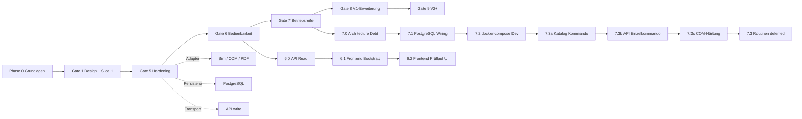

# Roadmap — PWE

Verbindliche Übersicht über Projektfortschritt, Prioritäten und Abhängigkeiten.

**Pflege-Regel:** Bei jedem abgeschlossenen Roadmap-Slice dieses Dokument aktualisieren (Status, PR/Commit, Changelog unten). Prozess: `docs/projektrules.md` §7. Neue Erkenntnisse dürfen die Roadmap ändern — mit begründetem Changelog-Eintrag.

Referenzen: `docs/architecture.md`, ADRs in `docs/adr/`, Fachdomäne `docs/domain-model.md`.

---

## Legende

| Symbol | Bedeutung |
|--------|-----------|
| ✅ | Abgeschlossen |
| 🔄 | In Arbeit |
| ⏳ | Geplant (priorisiert) |
| ⏸ | Deferred (bewusst zurückgestellt) |

---

## Gesamtübersicht

**▶ Aktueller Stand:** Gate 7.3b ✅ (PR #17) — **Gate 7.3c in Arbeit** (Branch `feat/gate-7-3c-com-hardening`)

---

## Phase 0 — Grundlagen ✅

| # | Schritt | Status | Referenz |
|---|---------|--------|----------|
| 0.1 | Project Bootstrap (Struktur, DNA, Governance) | ✅ | PR [#1](https://github.com/Rei1000/PWE/pull/1) — `b970ac4`, CI `def8e00` |
| 0.2 | Pflichtenheft, Architektur, Projektstruktur | ✅ | PR #1, PR [#2](https://github.com/Rei1000/PWE/pull/2) — `fc60e08` |
| 0.3 | Engine-First Bounded Contexts etabliert | ✅ | `docs/architecture.md` |

---

## Gate 1 — Design & Vertical Slice 1 ✅

| # | Schritt | Status | Referenz |
|---|---------|--------|----------|
| 1.1 | V1-Scope ADR (PC-only, Smartphone V2+) | ✅ | [ADR-0001](adr/0001-v1-scope-deferrals.md) |
| 1.2 | Domain-Entscheidungen §12 (Nachweis-Wellen, Protokoll, Sollvorgaben, …) | ✅ | [ADR-0003](adr/0003-routine-nachweis-wellen.md) … [ADR-0008](adr/0008-prueflauf-abschluss-view.md) |
| 1.3 | Backend-Stack ADR | ✅ | [ADR-0002](adr/0002-backend-stack.md) |
| 1.4 | Technical Domain + Teststrategie | ✅ | `docs/technical-domain/`, `docs/test-strategy.md` |
| 1.5 | Vertical Slice 1 — Prüflauf-Kern (Domain + Application + In-Memory) | ✅ | PR [#3](https://github.com/Rei1000/PWE/pull/3) — `b81e207`, P0-Fix `85a4e81` |

**Abhängigkeit:** Phase 0 abgeschlossen.

---

## Gate 5 — Hardening (Persistenz, Adapter, API) ✅

| # | Schritt | Status | Referenz | Abhängigkeit |
|---|---------|--------|----------|--------------|
| 5.1 | Katalog Slice 2 — Entwurf → Veröffentlichen | ✅ | PR [#4](https://github.com/Rei1000/PWE/pull/4) — `1d99c60` | Gate 1 |
| 5.2 | PostgreSQL-Persistenz | ✅ | PR [#5](https://github.com/Rei1000/PWE/pull/5) — `2e5bee6` | 5.1 |
| 5.3 | Adapter Simulation (`ExternesKommandoPort`) | ✅ | PR [#6](https://github.com/Rei1000/PWE/pull/6) — `00f65ad` | Gate 1 |
| 5.4 | Adapter COM | ✅ | PR [#7](https://github.com/Rei1000/PWE/pull/7) — `54d9c80` | 5.3 |
| 5.5 | Adapter PDF (`ProtokollErzeugungPort`) | ✅ | PR [#8](https://github.com/Rei1000/PWE/pull/8) — `f30366f` | Gate 1 |
| 5.6 | API-Slice — FastAPI, Prüflauf write, Katalog minimal, Fehlerformat | ✅ | PR [#9](https://github.com/Rei1000/PWE/pull/9) — `c486fdc`, `ae04236`, Merge `8c202a3` | 5.1, 5.5 |

---

## Gate 6 — Bedienbarkeit (PC) ✅

Frontend-Stack verbindlich: [ADR-0009](adr/0009-frontend-stack.md).

| # | Schritt | Status | Prio | Referenz | Abhängigkeit |
|---|---------|--------|------|----------|--------------|
| 6.0 | **API Read-Slice** — `GET /prueflaeufe/{id}` (Schritte, Status, Nachweise) | ✅ | **P0** | PR [#10](https://github.com/Rei1000/PWE/pull/10) | 5.6 |
| 6.1 | Frontend Bootstrap (Vite, React, API-Client, Dev-Proxy) | ✅ | P1 | PR [#11](https://github.com/Rei1000/PWE/pull/11) — Merge `f94387b` | 6.0, ADR-0009 |
| 6.2 | Frontend Slice 1 — PC Prüflauf Happy Path | ✅ | P1 | PR [#12](https://github.com/Rei1000/PWE/pull/12) — Merge `e49fc99` | 6.1 |

### Roadmap-Anpassung (2026-06-27)

**Erkenntnis nach API-Merge (PR #9):** Die API ist write-lastig; `docs/architecture.md` §8 verlangt, dass das Frontend materialisierte ProzedurSchritte **lesen** kann. Daher **6.0 vor 6.1** — kein Scope Creep, sondern Vervollständigung des HTTP-Contracts für den Driving Adapter Frontend.

**Frontend-Stack-Entscheidung (ADR-0009):** Ändert die Reihenfolge **nicht** — Bootstrap (6.1) folgt weiterhin nach lesbarem API-Contract.

---

## Gate 7 — Betriebsreife ✅

| # | Schritt | Status | Prio | Referenz | Abhängigkeit |
|---|---------|--------|------|----------|--------------|
| 7.0 | **Architecture Debt** — Persistenz-Parität, Abschluss-Transaktion, API-Fehler, UI-Fortschritt | ✅ | **P1** | PR [#13](https://github.com/Rei1000/PWE/pull/13) — Merge `479ea9e` | 6.2, Architektur-Review |
| 7.1 | API ↔ PostgreSQL Wiring (`DATABASE_URL`, Session pro Request) | ✅ | P2 | PR [#14](https://github.com/Rei1000/PWE/pull/14) — Merge `48ab29e` | 7.0 |
| 7.2 | docker-compose Dev-Stack (API + Postgres) | ✅ | P2 | PR [#15](https://github.com/Rei1000/PWE/pull/15) — Merge `f526767` | 7.1 |
| 7.3 | **Routinen / Externes Kommando über API** (Gesamtfeature) | ⏸ | P2 | Aufgeteilt in 7.3a → 7.3b → 7.3c → vollständig 7.3 | 5.3–5.4, 6.2 |
| 7.3a | Katalog: Externes Kommando minimal | ✅ | P2 | PR [#16](https://github.com/Rei1000/PWE/pull/16) — Merge `b59d769`, [ADR-0012](adr/0012-katalog-bibliothek-externes-kommando.md) | 7.2, Domain Model §4.11 |
| 7.3b | API: Einzelkommando ausführen (`kommando_id`) | ✅ | P2 | PR [#17](https://github.com/Rei1000/PWE/pull/17) — Merge `b3d3761` | 7.3a |
| 7.3c | COM-Härtung (Wiring, Transport, PySerialTransport) | 🔄 | P2 | Branch `feat/gate-7-3c-com-hardening`, [ADR-0013](adr/0013-com-adapter-wiring-fehlerabbildung.md) | 7.3b |

### Roadmap-Anpassung (2026-07-12) — Gate 7.3 Zerlegung

**Entscheidung:** Vollständiges Gate 7.3 ist zu groß für einen Slice. Zerlegung in Teilschritte; **minimales Katalogmodell vor API**, damit keine freien technischen Kommandostrings Teil des öffentlichen HTTP-Contracts werden (Domain Model §4.11, Pflichtenheft zentrale Kommandoverwaltung).

| Slice | Inhalt | Bewusst nicht |
|-------|--------|---------------|
| **7.3a** | `ExternesKommando` in Bibliothek, `kommando_id`, Materialisierung in Version/Schritt | API-Ausführung, Routine, Frontend |
| **7.3b** | HTTP-Ausführung nur über `kommando_id`, Simulation-Default | Freie Kommandostrings, COM-Härtung |
| **7.3c** | COM-Wiring, Transport-Robustheit, `PySerialTransport`, Fehlerabbildung | Hardwaretests, Retry, Routinen, PySerial außerhalb Adapter |
| **7.3 (später)** | Routine-Domain, Orchestrierung, Wiederholung, Frontend | — |

---

## Gate 8 — V1-Erweiterung ⏸

| # | Schritt | Status | Prio | Abhängigkeit |
|---|---------|--------|------|--------------|
| 8.1 | Identity / Auth (Middleware, Rollen) | ⏸ | P2 | ADR-0001 erlaubt Deferral; `pruefer_id` im Body reicht für 6.x |
| 8.2 | Katalog-Admin-UI (Bibliothek, Vorlagen, Routinen) | ⏸ | P3 | 6.2 |
| 8.3 | Druck-Adapter, Foto/Storage | ⏸ | P3 | Ports offen |

---

## Gate 9 — V2+ ⏸

| # | Schritt | Status | Prio | Begründung Deferred |
|---|---------|--------|------|---------------------|
| 9.1 | Auswertung (Read Model, Dashboard) | ⏸ | P4 | Eigener Bounded Context; nach stabilem Run-Time-Kern |
| 9.2 | Smartphone / Sync | ⏸ | P4 | [ADR-0001](adr/0001-v1-scope-deferrals.md) — Sync-Modell ungeklärt, höchstes technisches Risiko |

---

## Bewusst Deferred (Querschnitt)

| Thema | Gate | Begründung |
|-------|------|------------|
| Auth / Identity-Context | 8.1 | V1 PC-only, ein Prüfer; ADR-0001 |
| API In-Memory-Default | 7.1 | Dev/Test ohne `DATABASE_URL`; docker-compose setzt PostgreSQL (Gate 7.2) |
| Vollständige Katalogverwaltung | 8.2 | Minimal-API (Entwurf/Veröffentlichen) reicht für Frontend-Slice 1; Kommando-Bibliothek schrittweise (7.3a) |
| Gate 7.3 Gesamtfeature | 7.3 | Zerlegt in 7.3a/7.3b/7.3c — siehe Gate-7-Tabelle |
| OpenAPI-Codegen / erweiterte 422-Details | 6.1+ | Optional mit Frontend Bootstrap |
| Aggregate Discovery als eigene Phase | — | In Technical Domain integriert (Gate 1) |

---

## Changelog (Roadmap)

| Datum | Änderung | Begründung |
|-------|----------|------------|
| 2026-07-12 | Gate 7.3c gestartet — COM-Wiring, PySerialTransport, ADR-0013 | Produktionsfähiger serieller Transport ohne Hardwaretests/Retry |
| 2026-07-12 | Gate 7.3b abgeschlossen (PR #17, Merge `b3d3761`) | HTTP-Ausführung über `kommando_id`, Simulation-Default, `postgres_deps_factory` |
| 2026-07-12 | Gate 7.3a abgeschlossen (PR #16, Merge `b59d769`) | ExternesKommando, BibliothekRepository, Materialisierung, ADR-0012 |
| 2026-07-12 | Gate 7.3b gestartet — API Einzelkommando über `kommando_id` | Ausführung nur aus materialisiertem Snapshot |
| 2026-07-12 | Gate 7.3 in 7.3a/7.3b/7.3c zerlegt; Katalog vor API | Keine freien Kommandostrings im HTTP-Contract; minimales Katalogmodell zuerst |
| 2026-07-12 | Gate 7.2 abgeschlossen (PR #15, Merge `f526767`) | docker-compose Dev-Stack API + PostgreSQL |
| 2026-07-12 | Gate 7.0–7.2 abgeschlossen (Betriebsreife-Basis) | Architecture Debt, PG-Wiring, Dev-Stack |
| 2026-07-12 | Gate 7.1 abgeschlossen (PR #14, Merge `48ab29e`) | PostgreSQL-Wiring, Request-UoW, ADR-0011, NachweisArt-Contract |
| 2026-07-12 | Gate 7.0 abgeschlossen (PR #13, Merge `479ea9e`) | Persistenz-Parität, Abschluss-Port, API-Fehler, UI-Fortschritt |
| 2026-07-12 | Gate 7.1 API ↔ PostgreSQL Wiring gestartet | Branch `feat/gate-7-1-postgresql-wiring` — konfigurierbare PG-Persistenz |
| 2026-07-12 | Gate 7.0 Architecture Debt eingefügt vor 7.1 | Architektur-Review: PG-Parität, Transaktion, API, UI-Fortschritt |
| 2026-07-12 | Gate 6.2 abgeschlossen (PR #12) | Frontend Happy Path + Prozess-Doku |
| 2026-07-12 | Entwicklungsprozess in projektrules §7; Cursor-Rules entschlackt | Slice-Workflow verbindlich ohne Doppel-Doku |
| 2026-06-28 | Gate 6.1 Frontend Bootstrap abgeschlossen | Vite/React/TS, shadcn, API-Client, Dev-Proxy, Health-Page |
| 2026-06-27 | Gate 6.0 API Read-Slice abgeschlossen | `GET /prueflaeufe/{id}` + `PrueflaufLesen` für Frontend-Adapter |
| 2026-06-27 | Roadmap initial erstellt; Gate 6 präzisiert (6.0 API Read vor Frontend) | API-Merge + Frontend-Stack-Entscheidung; Read-Endpoints fehlten für UI |
| 2026-06-27 | ADR-0009 Frontend-Stack aufgenommen | Verbindliche Stack-Festlegung vor Bootstrap |

---

## Nächster Slice

**Gate 7.3c — COM-Härtung** (🔄) — COM-Wiring und Transport-Robustheit inkl. `PySerialTransport`; **ohne** Hardwaretests und **ohne** Retry. Branch `feat/gate-7-3c-com-hardening`.
