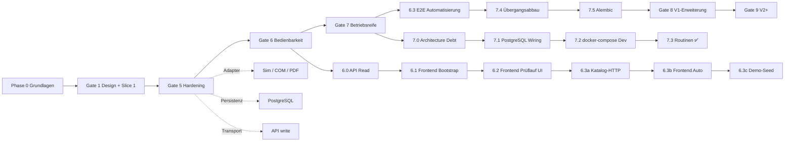

# Roadmap — PWE

Verbindliche Übersicht über Projektfortschritt, Prioritäten und Abhängigkeiten.

**Pflege-Regel:** Bei jedem abgeschlossenen Roadmap-Slice dieses Dokument aktualisieren (Status, PR/Commit, Changelog unten). Prozess: `docs/projektrules.md` §7. Neue Erkenntnisse dürfen die Roadmap ändern — mit begründetem Changelog-Eintrag.

Referenzen: `docs/architecture.md`, ADRs in `docs/adr/`, Fachdomäne `docs/domain-model.md`.

---

## Legende

| Symbol | Bedeutung |
|--------|-----------|
| ✅ | Abgeschlossen |
| 🔄 | In Arbeit |
| ⏳ | Geplant (priorisiert) |
| ⏸ | Deferred (bewusst zurückgestellt) |

---

## Gesamtübersicht

**▶ Aktueller Stand:** Gate 7 ✅ — **Gate 6.3a 🔄** (Minimaler Katalog-HTTP-Contract für Automatisierung, ADR-0017)

---

## Phase 0 — Grundlagen ✅

| # | Schritt | Status | Referenz |
|---|---------|--------|----------|
| 0.1 | Project Bootstrap (Struktur, DNA, Governance) | ✅ | PR [#1](https://github.com/Rei1000/PWE/pull/1) — `b970ac4`, CI `def8e00` |
| 0.2 | Pflichtenheft, Architektur, Projektstruktur | ✅ | PR #1, PR [#2](https://github.com/Rei1000/PWE/pull/2) — `fc60e08` |
| 0.3 | Engine-First Bounded Contexts etabliert | ✅ | `docs/architecture.md` |

---

## Gate 1 — Design & Vertical Slice 1 ✅

| # | Schritt | Status | Referenz |
|---|---------|--------|----------|
| 1.1 | V1-Scope ADR (PC-only, Smartphone V2+) | ✅ | [ADR-0001](adr/0001-v1-scope-deferrals.md) |
| 1.2 | Domain-Entscheidungen §12 (Nachweis-Wellen, Protokoll, Sollvorgaben, …) | ✅ | [ADR-0003](adr/0003-routine-nachweis-wellen.md) … [ADR-0008](adr/0008-prueflauf-abschluss-view.md) |
| 1.3 | Backend-Stack ADR | ✅ | [ADR-0002](adr/0002-backend-stack.md) |
| 1.4 | Technical Domain + Teststrategie | ✅ | `docs/technical-domain/`, `docs/test-strategy.md` |
| 1.5 | Vertical Slice 1 — Prüflauf-Kern (Domain + Application + In-Memory) | ✅ | PR [#3](https://github.com/Rei1000/PWE/pull/3) — `b81e207`, P0-Fix `85a4e81` |

**Abhängigkeit:** Phase 0 abgeschlossen.

---

## Gate 5 — Hardening (Persistenz, Adapter, API) ✅

| # | Schritt | Status | Referenz | Abhängigkeit |
|---|---------|--------|----------|--------------|
| 5.1 | Katalog Slice 2 — Entwurf → Veröffentlichen | ✅ | PR [#4](https://github.com/Rei1000/PWE/pull/4) — `1d99c60` | Gate 1 |
| 5.2 | PostgreSQL-Persistenz | ✅ | PR [#5](https://github.com/Rei1000/PWE/pull/5) — `2e5bee6` | 5.1 |
| 5.3 | Adapter Simulation (`ExternesKommandoPort`) | ✅ | PR [#6](https://github.com/Rei1000/PWE/pull/6) — `00f65ad` | Gate 1 |
| 5.4 | Adapter COM | ✅ | PR [#7](https://github.com/Rei1000/PWE/pull/7) — `54d9c80` | 5.3 |
| 5.5 | Adapter PDF (`ProtokollErzeugungPort`) | ✅ | PR [#8](https://github.com/Rei1000/PWE/pull/8) — `f30366f` | Gate 1 |
| 5.6 | API-Slice — FastAPI, Prüflauf write, Katalog minimal, Fehlerformat | ✅ | PR [#9](https://github.com/Rei1000/PWE/pull/9) — `c486fdc`, `ae04236`, Merge `8c202a3` | 5.1, 5.5 |

---

## Gate 6 — Bedienbarkeit (PC)

Frontend-Stack verbindlich: [ADR-0009](adr/0009-frontend-stack.md).

| # | Schritt | Status | Prio | Referenz | Abhängigkeit |
|---|---------|--------|------|----------|--------------|
| 6.0 | **API Read-Slice** — `GET /prueflaeufe/{id}` (Schritte, Status, Nachweise) | ✅ | **P0** | PR [#10](https://github.com/Rei1000/PWE/pull/10) | 5.6 |
| 6.1 | Frontend Bootstrap (Vite, React, API-Client, Dev-Proxy) | ✅ | P1 | PR [#11](https://github.com/Rei1000/PWE/pull/11) — Merge `f94387b` | 6.0, ADR-0009 |
| 6.2 | Frontend Slice 1 — PC Prüflauf Happy Path (manuell) | ✅ | P1 | PR [#12](https://github.com/Rei1000/PWE/pull/12) — Merge `e49fc99` | 6.1 |
| 6.3 | **End-to-End Automatisierung** (Gesamtfeature) | ⏳ | **P0** | Schließt Wertlücke nach Gate 7.3f | 7.3f, 6.2 |
| 6.3a | Minimaler Katalog-HTTP-Contract für Automatisierung | 🔄 | **P0** | ADR-0017, Branch `feat/gate-6-3a-katalog-automatisierung-api` | 7.3a, 5.6 |
| 6.3b | Frontend-Ausführung der Automatisierung (ADR-0016) | ⏳ | P0 | — | 6.3a |
| 6.3c | Demo-/Seed-Konfiguration mit automatisierbarem Schritt | ⏳ | P0 | — | 6.3a, 6.3b |

### Roadmap-Anpassung (2026-06-27)

**Erkenntnis nach API-Merge (PR #9):** Die API ist write-lastig; `docs/architecture.md` §8 verlangt, dass das Frontend materialisierte ProzedurSchritte **lesen** kann. Daher **6.0 vor 6.1** — kein Scope Creep, sondern Vervollständigung des HTTP-Contracts für den Driving Adapter Frontend.

**Frontend-Stack-Entscheidung (ADR-0009):** Ändert die Reihenfolge **nicht** — Bootstrap (6.1) folgt weiterhin nach lesbarem API-Contract.

### Roadmap-Anpassung (2026-07-14) — Gate 6.3 nach Gate 7.3

**Erkenntnis:** Gate 7.3 liefert den backend-fertigen Run-Time-Kern (Katalog-Materialisierung → `RoutineAusfuehren` → schrittzentrierte API), aber Gate 6.2 deckt nur den **manuellen** Prüferflow ab. Ohne Katalog-HTTP für Automatisierung und Frontend-Anbindung entsteht **kein End-to-End-Nutzen** am Arbeitsplatz.

**Entscheidung:** Gate 6.3 **nach** Gate 7.3 einfügen — vervollständigt Bedienbarkeit, kein neues Backend-Feature jenseits des minimalen Katalog-HTTP-Contracts.

| Slice | Inhalt | Bewusst nicht |
|-------|--------|---------------|
| **6.3a** | HTTP: Bibliothek-Kommando anlegen + Automatisierung an Entwurfsschritt zuweisen | Vollständige Admin-API, Routine-Anlage, Auth, Ausführung |
| **6.3b** | Frontend: `automatisierung/ausfuehren`, Ergebnisdarstellung (`fehlgeschlagen`, Nachweise) | Katalog-Admin-UI, Legacy-Endpunkt |
| **6.3c** | Demo-Seed über öffentliche 6.3a-Endpunkte (Frontend-Orchestrierung) | Dedizierter `/dev`-Wegwerf-Endpunkt, App-Start-Fixture als Produktionspfad |

---

## Gate 7 — Betriebsreife ✅

| # | Schritt | Status | Prio | Referenz | Abhängigkeit |
|---|---------|--------|------|----------|--------------|
| 7.0 | **Architecture Debt** — Persistenz-Parität, Abschluss-Transaktion, API-Fehler, UI-Fortschritt | ✅ | **P1** | PR [#13](https://github.com/Rei1000/PWE/pull/13) — Merge `479ea9e` | 6.2, Architektur-Review |
| 7.1 | API ↔ PostgreSQL Wiring (`DATABASE_URL`, Session pro Request) | ✅ | P2 | PR [#14](https://github.com/Rei1000/PWE/pull/14) — Merge `48ab29e` | 7.0 |
| 7.2 | docker-compose Dev-Stack (API + Postgres) | ✅ | P2 | PR [#15](https://github.com/Rei1000/PWE/pull/15) — Merge `f526767` | 7.1 |
| 7.3 | **Routinen / Externes Kommando über API** (Gesamtfeature) | ✅ | P2 | PR [#16](https://github.com/Rei1000/PWE/pull/16)–[#21](https://github.com/Rei1000/PWE/pull/21) — Merge `b59d769` … `c7beda3`; ADR-0012–0016 | 5.3–5.4, 6.2 |
| 7.3a | Katalog: Externes Kommando minimal | ✅ | P2 | PR [#16](https://github.com/Rei1000/PWE/pull/16) — Merge `b59d769`, [ADR-0012](adr/0012-katalog-bibliothek-externes-kommando.md) | 7.2, Domain Model §4.11 |
| 7.3b | API: Einzelkommando ausführen (`kommando_id`) | ✅ | P2 | PR [#17](https://github.com/Rei1000/PWE/pull/17) — Merge `b3d3761` | 7.3a |
| 7.3c | COM-Härtung (Wiring, Transport, PySerialTransport) | ✅ | P2 | PR [#18](https://github.com/Rei1000/PWE/pull/18) — Merge `d9b3bf0`, [ADR-0013](adr/0013-com-adapter-wiring-fehlerabbildung.md) | 7.3b |
| 7.3d | Routine: Katalogmodell + Materialisierung | ✅ | P2 | PR [#19](https://github.com/Rei1000/PWE/pull/19) — Merge `914b23e`, [ADR-0014](adr/0014-routine-katalog-materialisierung.md) | 7.3c |
| 7.3e | Routine: minimaler Runner (nur Kommando-Aktion) | ✅ | P2 | PR [#20](https://github.com/Rei1000/PWE/pull/20) — Merge `bb436a5`, [ADR-0015](adr/0015-routine-ausfuehren-application-runner.md) | 7.3d |
| 7.3f | Routine: API-Ausführung (schrittzentriert) | ✅ | P2 | PR [#21](https://github.com/Rei1000/PWE/pull/21) — Merge `c7beda3`, [ADR-0016](adr/0016-automatisierung-http-api.md) | 7.3e |
| 7.4 | **Abbau der Übergangsarchitektur** (Gesamtfeature) | ⏳ | P1 | Nach Gate 6.3 — Frontend nutzt Ziel-API | 6.3b, ADR-0014/0016 |
| 7.4a | Materialisierungs-Exit für Legacy-`externes_kommando` | ⏳ | P1 | ADR ergänzen | 7.4 |
| 7.4b | Entfernung des deprecated Einzelkommando-HTTP-Endpunkts | ⏳ | P1 | Nach 6.3b | 7.4a |
| 7.4c | Minimale fachliche Monitoring-Baseline | ⏳ | P2 | ADR-0016-Hinweis | 6.3b |
| 7.5 | **Datenbankmigrationen** (Gesamtfeature) | ⏳ | P1 | — | — |
| 7.5a | Alembic-Bootstrap und Initialmigration | ⏳ | P1 | Aus `schema.py` | 7.5 |
| 7.5b | CI und Docker auf Migrationen umstellen | ⏳ | P1 | Ersetzt `create_all`-Only | 7.5a |

### Roadmap-Anpassung (2026-07-12) — Gate 7.3 Zerlegung

**Entscheidung:** Vollständiges Gate 7.3 ist zu groß für einen Slice. Zerlegung in Teilschritte; **minimales Katalogmodell vor API**, damit keine freien technischen Kommandostrings Teil des öffentlichen HTTP-Contracts werden (Domain Model §4.11, Pflichtenheft zentrale Kommandoverwaltung).

| Slice | Inhalt | Bewusst nicht |
|-------|--------|---------------|
| **7.3a** | `ExternesKommando` in Bibliothek, `kommando_id`, Materialisierung in Version/Schritt | API-Ausführung, Routine, Frontend |
| **7.3b** | HTTP-Ausführung nur über `kommando_id`, Simulation-Default | Freie Kommandostrings, COM-Härtung |
| **7.3c** | COM-Wiring, Transport-Robustheit, `PySerialTransport`, Fehlerabbildung, Audit-Regel | Hardwaretests, Retry, Routinen |
| **7.3d–7.3f** | Routine Katalog → Runner → API | Weitere Aktionstypen, Frontend, Wiederholung |
| **7.3 (Gesamt)** | Run-Time-Kern backend-fertig | Frontend, Legacy-Exit, Materialisierungs-Exit |

### Roadmap-Anpassung (2026-07-14) — Gates 7.4 und 7.5

**Erkenntnis nach Gate 7.3:** Bewusste Übergangsarchitektur (dualer HTTP-Endpunkt, dual materialisiertes `externes_kommando`) und fehlende schema-versionierte Migrationen (`create_all` only) sind **technische Schulden**, die vor Gate 8 beseitigt werden sollten.

| Gate | Zweck | Reihenfolge |
|------|-------|-------------|
| **7.4** | Übergangsabbau — Materialisierungs-Exit, Legacy-HTTP entfernen, Monitoring-Baseline | Nach 6.3b (Frontend auf Ziel-API) |
| **7.5** | Alembic — reproduzierbare Schema-Evolution | Nach 6.3a (keine Schema-Änderung in 6.3a erwartet); vor Prod-Deploy |

---

## Gate 8 — V1-Erweiterung ⏳

**Neu priorisiert (2026-07-14):** Solange [ADR-0001](adr/0001-v1-scope-deferrals.md) und Einzel-PC-Laborbetrieb gelten, **Katalog-Admin vor Auth**, Foto/Storage getrennt, Auth vor echtem Mehrbenutzerbetrieb.

| # | Schritt | Status | Prio | Abhängigkeit |
|---|---------|--------|------|--------------|
| 8.2 | Katalog-Administration (Bibliothek, Vorlagen, Routinen — HTTP + UI, gesliced) | ⏳ | P2 | 6.3, 7.5 |
| 8.2a | Bibliothek-HTTP CRUD (Kommandos, Routinen, Listen) | ⏳ | P2 | 6.3a |
| 8.2b | Vorlagen und erweiterte Entwurfsbearbeitung | ⏳ | P3 | 8.2a |
| 8.2c | Katalog-Admin-UI | ⏳ | P3 | 8.2a |
| 8.3 | Foto / Storage (`DateiSpeicherPort`) | ⏳ | P2 | 6.3, Ports offen |
| 8.3a | Storage-Port und Nachweis-Integration | ⏳ | P2 | 8.3 |
| 8.3b | Frontend Foto-Upload | ⏳ | P3 | 8.3a |
| 8.4 | Druck-Adapter (`DruckPort`) | ⏳ | P3 | PDF vorhanden (Gate 5.5) |
| 8.1 | Identity / Auth (Middleware, Rollen) | ⏸ | P2 | Vor echtem Mehrbenutzerbetrieb; nach 8.2a empfohlen |

---

## Gate 9 — V2+ ⏸

| # | Schritt | Status | Prio | Begründung Deferred |
|---|---------|--------|------|---------------------|
| 9.1 | Auswertung (Read Model, Dashboard) | ⏸ | P4 | Eigener Bounded Context; nach stabilem Run-Time-Kern und Auth |
| 9.2 | Smartphone / Sync | ⏸ | P4 | [ADR-0001](adr/0001-v1-scope-deferrals.md) — Sync-Modell ungeklärt, höchstes technisches Risiko |

---

## Bewusst Deferred (Querschnitt)

| Thema | Gate | Begründung |
|-------|------|------------|
| Auth / Identity-Context | 8.1 | V1 PC-only, ein Prüfer; ADR-0001 — vor Mehrbenutzerbetrieb |
| Vollständige Katalogverwaltung | 8.2 | 6.3a liefert Minimal-Setup; vollständige Admin-UI später |
| Gate 7.3 Nacharbeiten | 7.4 | Legacy-Exit, deprecated HTTP — nach 6.3b |
| Schema-Migrationen | 7.5 | Alembic statt `create_all`-Only |
| API In-Memory-Default | 7.1 | Dev/Test ohne `DATABASE_URL`; docker-compose setzt PostgreSQL (Gate 7.2) |
| OpenAPI-Codegen / erweiterte 422-Details | 6.1+ | Optional mit Frontend Bootstrap |
| Auswertung / Smartphone | 9.x | ADR-0001, eigener Context / höchstes Risiko |

---

## Changelog (Roadmap)

| Datum | Änderung | Begründung |
|-------|----------|------------|
| 2026-07-14 | Gate 6.3a gestartet — Katalog-Setup-HTTP (ADR-0017) | POST Kommando + PUT Automatisierung-Zuweisung für E2E-Flow |
| 2026-07-14 | Roadmap-Neupriorisierung: Gate 6.3, 7.4, 7.5 eingeführt; Gate 8 neu sortiert (8.2 vor 8.1) | Architektur-Neubewertung nach Gate 7.3-Abschluss |
| 2026-07-14 | Gate 7.3 vollständig abgeschlossen — 7.3f merged (PR #21, `c7beda3`); Gesamtfeature 7.3 ✅ | Backend Run-Time-Kern E2E-fähig (ohne Frontend-Anbindung) |
| 2026-07-14 | Gate 6.3 eingeführt — End-to-End Automatisierung (6.3a–6.3c) | Schließt Wertlücke: Katalog-Setup + Frontend-Ausführung fehlen trotz 7.3f |
| 2026-07-14 | Gate 7.4 eingeführt — Übergangsarchitektur abbauen | Dual-HTTP, dual-Materialisierung, Monitoring offen |
| 2026-07-14 | Gate 7.5 eingeführt — Alembic/Migrationen | Five-Year-Challenge; `create_all` reicht nicht für Prod |
| 2026-07-14 | Gate 8 neu priorisiert: Katalog-Admin (8.2) vor Auth (8.1); Foto/Druck getrennt | ADR-0001 Einzel-PC; Admin-Bedarf vor Mehrbenutzer-Sicherheit |
| 2026-07-14 | Gate 7.3f abgeschlossen (PR #21, Merge `c7beda3`) | ADR-0016, schrittzentrierter Endpunkt, Legacy deprecated |
| 2026-07-14 | Gate 7.3e abgeschlossen (PR #20, Merge `bb436a5`) | RoutineAusfuehren, ADR-0015 |
| 2026-07-14 | Gate 7.3d abgeschlossen (PR #19, Merge `914b23e`) | ADR-0014 |
| 2026-07-12 | Gate 7.3c abgeschlossen (PR #18, Merge `d9b3bf0`) | ADR-0013 |
| 2026-07-12 | Gate 7.3b abgeschlossen (PR #17, Merge `b3d3761`) | API Einzelkommando |
| 2026-07-12 | Gate 7.3a abgeschlossen (PR #16, Merge `b59d769`) | ADR-0012 |
| 2026-07-12 | Gate 7.2 abgeschlossen (PR #15, Merge `f526767`) | docker-compose |
| 2026-07-12 | Gate 7.0–7.1 abgeschlossen (PR #13–#14) | Architecture Debt, PG-Wiring |
| 2026-07-12 | Gate 6.2 abgeschlossen (PR #12) | Frontend Happy Path |
| 2026-06-28 | Gate 6.1 abgeschlossen | Frontend Bootstrap |
| 2026-06-27 | Gate 6.0 abgeschlossen (PR #10) | API Read-Slice |
| 2026-06-27 | Roadmap initial erstellt | — |

---

## Nächster Slice

**Gate 6.3a — Minimaler Katalog-HTTP-Contract für Automatisierung** (🔄, P0) — ADR-0017; Voraussetzung Gate 7.3 ✅.
